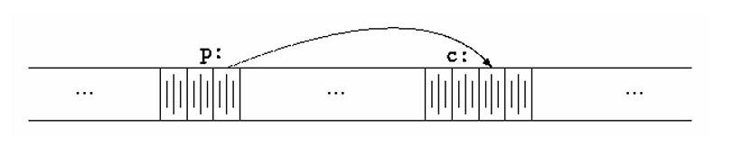
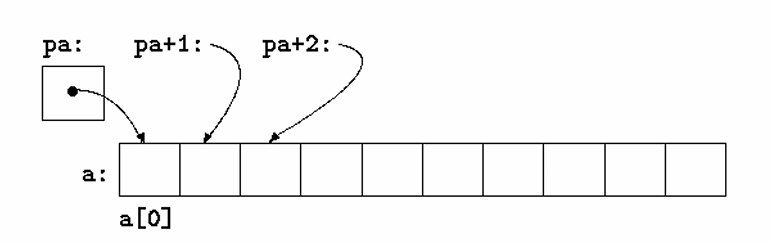

# Chapter 5 - Pointers and Arrays
A pointer is a variable that contains the address of a variable.
# 5.1 Pointers and Addresses
Here is a picture of how memory within a computer would be stored.

The unary operator ```&``` gives the address of an object, so the statement
```c
p = &c;
```
assigns the address of ```c``` to the variable ```p```, and ```p``` is said to "point to" ```c```. The ```&``` operator only applies to objects in memory: variables and array elements. It cannot be applied to expressions, constants, or ```register``` variables.

The unary operator ```*``` is the indirection or dereferencing operator; when applied to a pointer, it accesses the object the pointer points to.
```c
int x = 1, y = 2, z[10];
int *ip; // ip is a pointer to int

ip = &x; // ip now points to x
y = *ip; // y is now 1
*ip = 0; // x is now 0
ip = &z[0]; // ip now points to z[0]
```
## 5.2 Pointers and Function Arguments
Since C passes arguments to functions by value, there is no direct way for the called function to alter a variable in the calling function. For instance, a sorting routine might exchange two out-of-order arguments with a function called ```swap```. It is not enough to write
```c
swap(a, b);
```
where the ```swap``` function is defined as
```c
void swap(int x, int y) {
    int temp;
    
    temp = x;
    x = y;
    y = temp;
}
```
Because of call by value, ```swap``` can't affect the arguments ```a``` and ```b``` in the routine that called it. The function above swaps copies of ```a``` and ```b```.

The way to obtain the desired effect is for the calling program to pass pointers to the values to be changed:
```c
swap(&a, &b);
```
```c
void swap(int *px, int *py) {
    int temp;

    temp = *px;
    *px = *py;
    *py = temp;
}
```
## 5.3 Pointers and Arrays
In C, there is a strong relationship between pointers and arrays, strong enough that pointers and arrays should be discussed simultaenously. Any operation that can be achieved by array subscripting can also be done with pointers. The pointer version will in general be faster but, at least to the uninitiated, somewhat harder to understand. Lets say we have this array.
```c
int a[10];
```
The notation ```a[i]``` refers to the i-th element of the array. If ```pa``` is a pointer to an integer, declared as:
```c
int *pa;
```
then the assignment
```c
pa = &a[0];
```
sets ```pa``` to point to element zero of ```a```; that is, ```pa``` contains the address of ```a[0]```.

Now the assignment
```c
x = *pa;
```
will copy the contents of ```a[0]``` into ```x```.

If ```pa``` points to a particular element of an arary, then by definition ```pa+1``` points to the next element, ```pa+1``` points ```i``` elements after ```pa```, and ```pa-i``` points ```i``` elements before. Thus, if ```pa``` points to ```a[0]```, ```*(pa+1)``` refers to the contents of ```a[1]```, ```pa+i``` is the address of ```a[i]```, and ```*(pa+i)``` is the contents of ```a[i]```.

