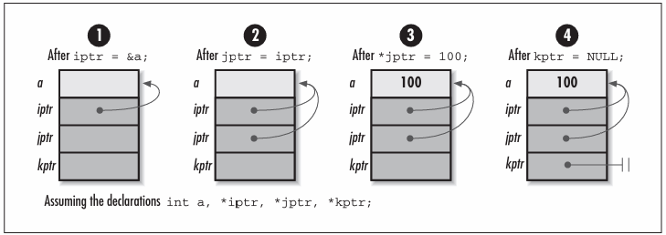
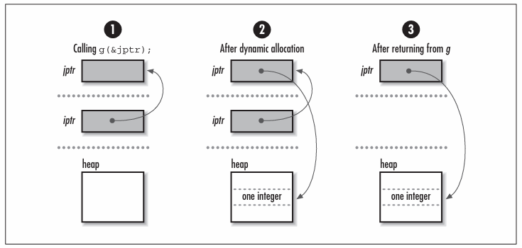
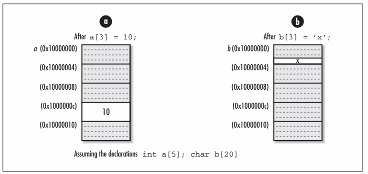

# Chapter 2 - Pointer Manipulation
In C, for any type ***T***, we can form a corresponding type for variables that contain addresses in memory where objects of type ***T*** reside. One way to look at variables like this is that they actually "point to" the objects. Thus, these variables are called *pointers*. Pointers are very important in C, but in many ways, they are a blessing and a curse. On the one hand, they are a powerful means of building data structures and precisely maniupulating memory. On the other hand, they are easy to misuse, and their misuse often leads to unpredictably buggy software; thus, they come with a great deal of responsibility. Considering this, it is no surprise that pointers embody what some people love about C and what other people hate. Whatever the case, to use C effectively, we must have a thorough understanding of them. This chapter presents several topics on pointers.

## Pointer Fundamentals
Recall that a pointer is simply a variable that stores the address where a piece of data resides in memory rather than storing the data itself. That is, pointers contain memory addresses. Even for experienced developers, at times this level of indirection can be a bit difficult to visualise, particularly when dealing with more complicated pointer constructs, such as pointers to other pointers.

As with other types of variables, we should not assume that a pointer points anywhere useful until we explicitly set it. It is also important to remember that nothing prevents a pointer in C from pointing to an invalid address. Pointers that point to iunvalid addresses are sometimes called *dangling pointers*. Some exmaples of programming errors that can lead to dangling pointers include casting arbitrary integers to pointers, adjusting pointers beyong the bouds of arrays, and deallocating storage that one or more pointers still reference.

## Storage Allocation
When we declare a pointer in C, a certain amount of space is allocated for it, just as for other types of variables. Pointers generally occupy one machine word, but their size can vary.

Therefore, for portability, we should never assume that a pointer has a specific size. Pointers often vary in size as a result of compiler settings and type specifiers allowed by certain C implementations. It is also important to remember that when we declare a pointer, space is allocated only for the pointer itself; no space is allocated for the data the pointer references. Storage for the data is allocated in one of two ways: by declaring a variable for it or by allocating storage dynamically at runtime (using *malloc* or *realloc*, for example).

When we declare a variable, its type tells the compiler how much storage to set aside for it as the program runs. Storage for the variable is allocated automatically, but it may not be persistent throughout the life of the program. This is especially important to remember when dealing with pointers to *automatic variables*. Automatic variables are those for which storage is allocated and deallocated automatically when entering and leaving a block or function. For example, since ```iptr``` is set to the address of the automatic variable ```a``` in the following function *f*, ```iptr``` becomes a dangling pointer when *f* returns. This situation occurs because once *f* returns, ```a``` is no longer valid on the program stack.
```c
int f(int **iptr) {
    int a = 10;
    *iptr = &a;
    return 0;
}
```
In C, when we dynamically allocate storage, we get a pointer to some storage on the heap. Since it is then our responsibility to manage this storage ourselves, the storage remains valid until we explicitly dellocate it. For example, the storage allocated by *malloc* in the following code remains valid until we call *free* at some later time. Thus, it remains valid even after *g* returns, unlike the storage allocated automatically for ```a``` previously. The parameter ```iptr``` is a pointer to the object we wish to modify (another pointer) so that when *g* returns, ```iptr``` contains the address returned by *malloc*.
```c
#include <stdlib.h>

int g(int **iptr) {
    if ((*iptr = (int *)malloc(sizeof(int))) == NULL) {
        return -1;
    }
    return 0;
}
```


Pointers and storage allocation are arguably the areas of C that provide the most fodder for the language's sometimes bad reputation. The misuse of dynamically allocated storage, in particular, is a notorious source of *memory leaks* Memory leaks are blocks of storage that are allocated but never freed by a program, even when no longer in use. They are particularly detrimental when found in sections of code that are executed repeatedly. Fortunately, we can greatly reduce memory leaks by employing consistent approaches to how we manage storage.

One example of a consistent approach to storage management is the one used for data structures presented in this book. The philosophy followed in every case is that it is the responsibility of the user to manage the storage associated with the actual data that the data structure organises; the data structure itself allocated storage only for internal structures sued to keep the data organised. Consequently, only pointers are maintained to the data inserted into the data structure, rather than private copies of the data. One important implication of this is that a data structure's implementation does not depend on the type and size of the data it stores. Also, multiple data structures are able to operate on a single copy of data, which can be useful when organising large amounts of data.

In addition, this book provides operations for initialising and destroying data structures. Initialisation may involve many steps, one of which may be the allocation of memory. Destroying the data structure generally involves removing all of its data and freeing the memory allocated in the data structure. Destroying a data structure also usually involves freeing all memory associated within the data itself. This is the one exception to having the user manage storage for the data. Since managing this storage is an application-specific operation, each data structure uses a function provided by the user when the data structure is initialised.

## Aggregates and Pointer Arithmetic
One of the most common uses of pointers in C is referencing *aggregate data*. Aggregate data is data composed of multiple elements grouped together because they are somehow related. C supports two classes of aggregate data: *structures* and *arrays*. (Unions, although similar to structures, are considered formally to be in a class by themselves).

### Structures
Structures are sequences of usually heterogeneous elements grouped so that they can be treated together as a single coherent datatype. Pointers to structures are an important part of building data structures. Whereas structures allow us to group data into convenient bundles, pointers let us link these bundles to one another in memory. By linking structures together, we can organise them in meaningful ways to help solve real problems.

As an example, consider chaining a number of elements together in memory to form a *linked list*. TO do this, we might use a structure like ```ListElmt``` in the following code. Using a ```ListElmt``` structure for each element i nteh list, to link a sequence of list elements together, we set the ```next``` member of each element to point to th element that comes after it. We set the ```next``` member of the last element to ```NULL``` to mark the end of the list. We set the ```data``` member of each element to point to the data the element contains Once we have a list comtaining elements linked in this way, we can traverse the list by following one ```next``` pointer after another.
```c
typedef struct ListElmt_ {
    void *data;
    struct ListElmt_ *next;
} ListElmt;
```
The ```ListElmt``` structure illustrates another important aspect about pointers with structures: structures are not permitted to contain instances of themselves, but they may contain *pointers to* instances of themselves. This is an important idea in building data structures because many data structures are built from components that are self-referential. In a linked list, for example, each ```ListElmt``` structure points to another ```ListElmt``` structure. Some data structures are even built from structures containing multiple pointers to structures of the same type. In a binary tree, for example, each node has pointers to two other binary tree nodes.

### Arrays
Arrays are sequences of homogeneous elements arranged consecutively in memory. In C, arrays are closely related to pointers. In fact, when an array identifier occurs in an expression, C converts the array transparently into an unmodifiable pointer that points to the array's first element. Considering this, the two following functions are equivalent.

#### Array Reference
```c
int f() {
    int a[10], *iptr;
    iptr = a;
    iptr[0] = 5;
    return 0;
}
```
#### Pointer Reference
```c
int g() {
    int a[10], *iptr;
    iptr = a;
    *iptr = 5;
    return 0;
}
```
To understand the relationship between arrays and pointers in C, recall that to access the **i**th element in an array ```a```, we use the expression:
```c
a[i];
```
The reason that this expression accesses the **i**th element of ```a``` is that C treats ```a``` in this expression the same as a pointer that points to the first element of ```a```. The expression as a whole is equivalent to:
```c
*(a + i);
```
which is evaluated using the rules of *pointer arithmetic*. Simply stated, when we add an integer *i* to a pointer, the result is the address, plus *i* times the number of bytes in the datatype the pointer references; it is not simply the address stored in the pointer plus *i* bytes. An analogous operation is performed when we subtract an interger from a pointer. This explains why arrays are zero-indexed in C; that is, the first element in an array is at position 0.

The conversion of a multidimensional array to a pointer is analogous to converting a one-dimensional array. However, we alos must remember that in C, multidimensional arrays are stored in row-major order. This means that subscripts to the right vary more rapidly than those to the left. To access the elements at row *i* and column *j* in a two-dimensional array, we use the expression:
```c
a[i][j];
```
C treats ```a``` in this expression as a pointer that points to the element at row 0, column 0 in ```a```. The expression as a whole is equivalent to:
```c
*(*(a + i) + j);
```


### Pointers as Parameters to Functions