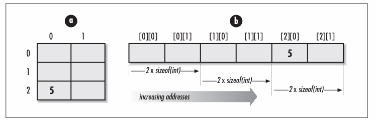
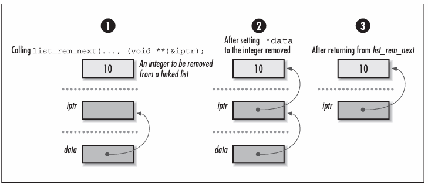

# Chapter 2 - Pointer Manipulation
In C, for any type ***T***, we can form a corresponding type for variables that contain addresses in memory where objects of type ***T*** reside. One way to look at variables like this is that they actually "point to" the objects. Thus, these variables are called *pointers*. Pointers are very important in C, but in many ways, they are a blessing and a curse. On the one hand, they are a powerful means of building data structures and precisely maniupulating memory. On the other hand, they are easy to misuse, and their misuse often leads to unpredictably buggy software; thus, they come with a great deal of responsibility. Considering this, it is no surprise that pointers embody what some people love about C and what other people hate. Whatever the case, to use C effectively, we must have a thorough understanding of them. This chapter presents several topics on pointers.

## Pointer Fundamentals
Recall that a pointer is simply a variable that stores the address where a piece of data resides in memory rather than storing the data itself. That is, pointers contain memory addresses. Even for experienced developers, at times this level of indirection can be a bit difficult to visualise, particularly when dealing with more complicated pointer constructs, such as pointers to other pointers.

As with other types of variables, we should not assume that a pointer points anywhere useful until we explicitly set it. It is also important to remember that nothing prevents a pointer in C from pointing to an invalid address. Pointers that point to iunvalid addresses are sometimes called *dangling pointers*. Some exmaples of programming errors that can lead to dangling pointers include casting arbitrary integers to pointers, adjusting pointers beyong the bouds of arrays, and deallocating storage that one or more pointers still reference.

## Storage Allocation
When we declare a pointer in C, a certain amount of space is allocated for it, just as for other types of variables. Pointers generally occupy one machine word, but their size can vary.

Therefore, for portability, we should never assume that a pointer has a specific size. Pointers often vary in size as a result of compiler settings and type specifiers allowed by certain C implementations. It is also important to remember that when we declare a pointer, space is allocated only for the pointer itself; no space is allocated for the data the pointer references. Storage for the data is allocated in one of two ways: by declaring a variable for it or by allocating storage dynamically at runtime (using *malloc* or *realloc*, for example).

When we declare a variable, its type tells the compiler how much storage to set aside for it as the program runs. Storage for the variable is allocated automatically, but it may not be persistent throughout the life of the program. This is especially important to remember when dealing with pointers to *automatic variables*. Automatic variables are those for which storage is allocated and deallocated automatically when entering and leaving a block or function. For example, since ```iptr``` is set to the address of the automatic variable ```a``` in the following function *f*, ```iptr``` becomes a dangling pointer when *f* returns. This situation occurs because once *f* returns, ```a``` is no longer valid on the program stack.
```c
int f(int **iptr) {
    int a = 10;
    *iptr = &a;
    return 0;
}
```
In C, when we dynamically allocate storage, we get a pointer to some storage on the heap. Since it is then our responsibility to manage this storage ourselves, the storage remains valid until we explicitly dellocate it. For example, the storage allocated by *malloc* in the following code remains valid until we call *free* at some later time. Thus, it remains valid even after *g* returns, unlike the storage allocated automatically for ```a``` previously. The parameter ```iptr``` is a pointer to the object we wish to modify (another pointer) so that when *g* returns, ```iptr``` contains the address returned by *malloc*.
```c
#include <stdlib.h>

int g(int **iptr) {
    if ((*iptr = (int *)malloc(sizeof(int))) == NULL) {
        return -1;
    }
    return 0;
}
```


Pointers and storage allocation are arguably the areas of C that provide the most fodder for the language's sometimes bad reputation. The misuse of dynamically allocated storage, in particular, is a notorious source of *memory leaks* Memory leaks are blocks of storage that are allocated but never freed by a program, even when no longer in use. They are particularly detrimental when found in sections of code that are executed repeatedly. Fortunately, we can greatly reduce memory leaks by employing consistent approaches to how we manage storage.

One example of a consistent approach to storage management is the one used for data structures presented in this book. The philosophy followed in every case is that it is the responsibility of the user to manage the storage associated with the actual data that the data structure organises; the data structure itself allocated storage only for internal structures sued to keep the data organised. Consequently, only pointers are maintained to the data inserted into the data structure, rather than private copies of the data. One important implication of this is that a data structure's implementation does not depend on the type and size of the data it stores. Also, multiple data structures are able to operate on a single copy of data, which can be useful when organising large amounts of data.

In addition, this book provides operations for initialising and destroying data structures. Initialisation may involve many steps, one of which may be the allocation of memory. Destroying the data structure generally involves removing all of its data and freeing the memory allocated in the data structure. Destroying a data structure also usually involves freeing all memory associated within the data itself. This is the one exception to having the user manage storage for the data. Since managing this storage is an application-specific operation, each data structure uses a function provided by the user when the data structure is initialised.

## Aggregates and Pointer Arithmetic
One of the most common uses of pointers in C is referencing *aggregate data*. Aggregate data is data composed of multiple elements grouped together because they are somehow related. C supports two classes of aggregate data: *structures* and *arrays*. (Unions, although similar to structures, are considered formally to be in a class by themselves).

### Structures
Structures are sequences of usually heterogeneous elements grouped so that they can be treated together as a single coherent datatype. Pointers to structures are an important part of building data structures. Whereas structures allow us to group data into convenient bundles, pointers let us link these bundles to one another in memory. By linking structures together, we can organise them in meaningful ways to help solve real problems.

As an example, consider chaining a number of elements together in memory to form a *linked list*. TO do this, we might use a structure like ```ListElmt``` in the following code. Using a ```ListElmt``` structure for each element i nteh list, to link a sequence of list elements together, we set the ```next``` member of each element to point to th element that comes after it. We set the ```next``` member of the last element to ```NULL``` to mark the end of the list. We set the ```data``` member of each element to point to the data the element contains Once we have a list comtaining elements linked in this way, we can traverse the list by following one ```next``` pointer after another.
```c
typedef struct ListElmt_ {
    void *data;
    struct ListElmt_ *next;
} ListElmt;
```
The ```ListElmt``` structure illustrates another important aspect about pointers with structures: structures are not permitted to contain instances of themselves, but they may contain *pointers to* instances of themselves. This is an important idea in building data structures because many data structures are built from components that are self-referential. In a linked list, for example, each ```ListElmt``` structure points to another ```ListElmt``` structure. Some data structures are even built from structures containing multiple pointers to structures of the same type. In a binary tree, for example, each node has pointers to two other binary tree nodes.

### Arrays
Arrays are sequences of homogeneous elements arranged consecutively in memory. In C, arrays are closely related to pointers. In fact, when an array identifier occurs in an expression, C converts the array transparently into an unmodifiable pointer that points to the array's first element. Considering this, the two following functions are equivalent.

#### Array Reference
```c
int f() {
    int a[10], *iptr;
    iptr = a;
    iptr[0] = 5;
    return 0;
}
```
#### Pointer Reference
```c
int g() {
    int a[10], *iptr;
    iptr = a;
    *iptr = 5;
    return 0;
}
```
To understand the relationship between arrays and pointers in C, recall that to access the **i**th element in an array ```a```, we use the expression:
```c
a[i];
```
The reason that this expression accesses the **i**th element of ```a``` is that C treats ```a``` in this expression the same as a pointer that points to the first element of ```a```. The expression as a whole is equivalent to:
```c
*(a + i);
```
which is evaluated using the rules of *pointer arithmetic*. Simply stated, when we add an integer *i* to a pointer, the result is the address, plus *i* times the number of bytes in the datatype the pointer references; it is not simply the address stored in the pointer plus *i* bytes. An analogous operation is performed when we subtract an interger from a pointer. This explains why arrays are zero-indexed in C; that is, the first element in an array is at position 0.

The conversion of a multidimensional array to a pointer is analogous to converting a one-dimensional array. However, we alos must remember that in C, multidimensional arrays are stored in row-major order. This means that subscripts to the right vary more rapidly than those to the left. To access the elements at row *i* and column *j* in a two-dimensional array, we use the expression:
```c
a[i][j];
```
C treats ```a``` in this expression as a pointer that points to the element at row 0, column 0 in ```a```. The expression as a whole is equivalent to:
```c
*(*(a + i) + j);
```


### Pointers as Parameters to Functions
Pointers are an essential part of calling functions in C. Most importantly, they are used to support a type of parameter passing called *call-by-referencing*. In call-by-reference parameter passing, when a function changes a parameter passed to it, the change persists after the function returns. Contrast this with *call-by-value* parameter passing, in which changes to parameters persist only within the funciton itself. Pointers are also an efficient means of passing large amounts of data in and out of functions, whether we plan to modify the data or not. This method is efficient because only a pointer is passed instead of a complete copy of the data.

### Call-by-Reference Parameter Passing
Formally, C supports only call-by-value parameter passing. In call-by-value parameter passing, private copies of a function's calling parameters are made for the function to use as it executes. However, we can simulate call-by-reference parameter passing by passing pointers to parameters instead of passing the parameters themselves. Using this approach, a function gets a private copy of a pointer to each parameter in the caller's environment.

To understand how this works, first consider *swap1*, which illustrates an incorrect implementation of a function to swap two integers using call-by-value parameter passing without pointers. The function *swap2* corrects the problem by using pointers to simulate call-by-reference parameter passing.

#### Incorrect Swap
```c
void swap1(int x, int y) {
    int tmp;
    tmp = x;
    x = y;
    y = tmp;
    return;
}
```
#### Correct Swap
```c
void swap2(int *x, int *y) {
    int tmp;
    tmp = *x;
    *x = *y;
    *y = tmp;
    return;
}
```
In *swap1*, we are merely just swapping around local copies of the variables, without actually affecting the values of the variables we wanted to swap in the first place!

#### Array Reference
```c
int f1(int a[]) {
    a[0] = 5;
    return 0;
}
```
#### Pointer Reference
```c
int f2(int *a) {
    *a = 5;
    return 0;
}
```
The approach chosen depends on convention, and or wanting to convey something about how the parameter is used in the function. When using an array parameter, bounds information is often omitted since it is not required by the compiler. However, including bounds information can be a useful way to document a limit the function imposes on a parameter internally. Bounds information plays a more critical role with array parameters that are multidimensional.

When defining a function that accepts a multidimensional array, all but the first dimension must be specified so that pointer arithmetic can be performed when elements are accessed, as shown in the following code:
```c
int g(int a[][2]) {
    a[2][0] = 5;
    return 0;
}
```
To understand why we must include all but the first dimension, imagine a two-dimensional array of integers with three rows and two columns. In C, elements are stored in row-major order at increasing addresses in memory. This means that the two integers in the first row are stored first, followed by the two integers in the second row, followed by the two integers of the third row. Therefore, to access an element in any row but the first, we must know exactly how many elements to skip in each row to get to elements in the successive rows.



### Pointers to Pointers as Parameters
One situation in which pointers are used as parameters to functions is when a function must modify a pointer passed into it. To do this, the function is passed a *pointer to the pointer* to be modified. Consider the operation *list_rem_next*. Upon return, ```data``` points to the data removed from the list:
```c
int list_rem_next(List *list, ListElmt *element, void **data);
```
Since the operation must modify the pointer ```data``` to make it point to the data removed, we must pass the address of the pointer ```data``` in order to simulate call-by-reference parameter passing. Thus, the operation takes a pointer to a pointer as its third parameter. This is typical of how data is removed from most data structures.



## Generic Pointers and Casts
Recall that pointer variables in C have types just like other variables. The main reason for this is so that when we dereference a pointer, the compiler knows the type of data being pointed to and can access the data accordingly. However, sometimes we are not concerned about the type of data a pointer references. In these cases we use generic pointers, which bypass C's type system.

### Generic Pointers
Normally C allows assignments only between pointers of the same type. For example, given a character poointer ```sptr``` (a string) and an integer pointer ```iptr```, we are not permitted to assign ```sptr``` to ```iptr``` or ```iptr``` to ```sptr```. However, generic pointers can be set to pointers of any type, and vice versa. Thus, given a generic pointer ```gptr```, we are permitted to assign ```sptr``` to ```gptr``` or ```gptr``` to ```sptr```. To make a pointer generic in C, we declare it as a void pointer.

There are many situations in which void pointers are useful. For example, consider the standard C library function *memcpy*, which copies a block of data from one location in memory to another. Because *memcpy* may be used to copy data of any type, it makes sense that its pointer parameters are void pointers. Void pointers can be used to make other types of functions more generic as well. For example, we might have implemented the *swap2* function presented earlier so that it swapped data of any typ, as shown in the following code:
```c
#include <stdlib.h>
#include <stdio.h>

int swap2(void *x, void *y, int size) {
    void *tmp;

    if ((tmp = malloc(size)) == NULL) {
        return -1;
    }

    memcpy(tmp, x, size);
    memcpy(x, y, size);
    memcpy(y, tmp, size);
    free(tmp);
    return 0;
}
```
Void pointers are particularly useful when implementing data structures because they allow us to store and retrieve data of any type. Consider again the ```ListElmt``` structure presented earlier for linked lists. Recall that this structure contains two members, ```data``` and ```next```. Since ```data``` is declared as a void pointer, it can point to data of any type. Thus, we can use ```ListElmt``` structures to build any type of list.

One of the operations defined for linked lists is *list_ins_next*, which accepts a void pointer to the data to be inserted:
```c
int list_ins_next(List *list, ListElmt *element, void *data);
```
To insert an integer referenced by ```iptr``` into a list of integers, ```list```, after an element referenced by ```element```, we use the following call. C permits us to pass the integer pointer ```iptr``` for the parameter ```data``` because ```data``` is a void pointer.
```c
returnvalue = list_ins_next(&list, element, iptr);
```
When removing data from the list, it is important to use the correct type of pointer to retrieve the data removed. Doing so ensures that the data will be interpreted correctly if we try to do something with it. The operation for removing an element from a linked list is *list_rem_next*, which takes a pointer to a void pointer as its third parameter:
```c
int list_rem_next(List *list, ListElmt *element, void **data);
```
To remove an integer from ```list``` after an element referenced by ```element```, we use the following call. Upon return, ```iptr``` points to the data removed. We pass the address of the pointer ```iptr``` since the operation modifies the pointer itself to make it point to the data removed.
```c
returnvalue = list_rem_next(&list, element, (void **)&iptr);
```
This call also includes a *cast* to make ```iptr``` temporarily appear as a pointer to a void pointer, since this is what *list_rem_next* requries. As we will see in the next section, casting is a mechanism in C that lets us temporarily treat a variable of one type as a variable of another type. A cast is necessary here because, although a void pointer is compatible with any other type of pointer in C, a pointer to a void pointer is not.

### Casts
To cast a variable ```t``` of some type ```T``` to another type ```S```, we precede ```t``` with ```S``` in paranthesis. For example, to assign an integer pointer ```iptr``` to a floating-point pointer ```fptr```, we cast ```iptr``` to a floating-point pointer and then carry out the assignment, as shown:
```c
fptr = (float *)iptr;
```
After the assignment, ```iptr``` and ```fptr``` both contain the same address. However, the interpretation of the data at this address depends on which pointer we use to access it.

Casts are especially important with generic pointers because generic pointers cannot be dereferenced without casting them to some other type. This is because generic pointers give the compiler no information about what is being pointed to; thus, it is not clear how many bytes should be accessed, nor how the bytes should be interpreted. Casts are also a nice form of self-documentation when generic pointers are assigned to pointers of other types. Although the cast is not necessary in this case, it does improve a program's readability.

When casting pointers, one issue we need to be particularly sensitive to is the way data is aligned in memory. Specifically, we need to be aware that applying casts to pointers can undermine the alignment a computer expects. Often computers have alignment requriements so that certain hardware optimisations can make accessing memory mroe efficient. For example, a system may insist that all integers be aligned on word boundaries. Thus, given a void pointer that is not word aligned, if we cast the void pointer to an integer pointer and dereference it, we can expect an exception to occur at runtime.

## Function Pointers
Function pointers are pointers that, instead of pointing to data, point to executable code or to blocks of information needed to invoke executable code. They are used to store and manage functions as if they were pieces of data. Function pointers have a type that is described in terms of a return value and parameters that the function accepts. Declarations for function pointers look much like declarations for functions, except that an asterisk (*) appears before the function name, and the asterisk and name a surrounded by parentheses for reasons of associativity. For example, in the following code, ```match``` is declared as a pointer to a function that accepts two void pointers and returns an integer:
```c
int (*match)(void *key1, void *key2);
```
This declaration means that we can set ```match``` to point to any function that accepts two void pointers and returns an integer. For example, suppose *match_int* is a function that accepts two void pointers to integers and returns 1 if the integers match, or 0 otherwise. Assuming the previous declaration, we could set ```match``` to point to this function by executing the following statement:
```c
match = match_int;
```
To execute a function referenced by a function pointer, we simply use the function pointer wherever we would normally use the function itself. For example, to invoke the function referenced by ```match``` earlier, we execute the following statement, assuming ```x```, ```y```, and ```returnvalue``` have been declared as integers:
```c
returnvalue = match(&x, &y);
```
One important use of function pointers is to encapsulate functions into data structures. For example, in the implementation of chained hash tables, the data structure has a ```match``` member similar to the function pointer just described This pointer is used to invoke a function whenever we need to determine whether an element we are searching for matches an element in the table. We assign a function to this pointer when the table is intiialised. The function we assign has the same prototype as ```match``` but internally compares two elements of the appropriate type, depending on the type of data in the table for which the table has been defined. Using a pointer to store a function as part of a data structure is nice because it is yet another way to keep an implementation generic.