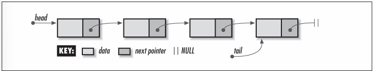
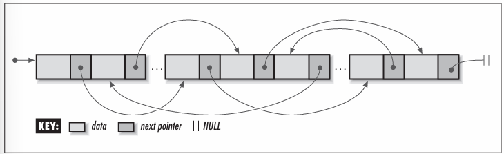

# Chapter 5 - Linked Lists
Linked lists are some of the most fundamental data structures Linked lists consist of a number of elements grouped, or *linked*, together in a specific order They are useful in maintaining collections of data, similar to the way that arrays are often used.

There are many different types of linked lists.
- Singly-linked lists
    - The simplest linked lists, in which elements are linked by a single pointer. This structure allows the list to be traversed from its first element to its last.

- Doubly-linked lists
    - Linked lists in which elements are linked by two pointers instead of one. This structure allows the list to be traversed both forward and backward.

- Circular lists
    - Linked lists in which the last element is linked to the first instead of being set to NULL. This structure allows the list to be traversed in a circular fashion.

Some applications of linked lists are:
- Mailing lists
- Scrolled lists
- Polynomials
- Memory management
- LISP
- Linked allocation of files
- Other data structures

## Description of Linked Lists
Singly-linked list, usually called linked lists, are composed of individual elements, each linked by a single pointer. Each element consists of two parts: a data member and a pointer, called the *next* pointer. Using this two-member structure, a linked list is formed by setting the *next* pointer of each element to point to the element that follows it. The next pointer of the last element is set to NULL, a covenient sentinel marking the end of the list. The element at the start of the list is its head; the element at the end of the list is its *tail*.

To access an elemment in a linked list, we start at the head of the list and use the *next* pointers of successive elements to move from element to element until the desired element is reached. With singly-linked lists, the list can be traversed in only one direction -- from head to tail -- because each element contains no link to its predecessor. Therefore, if we start at the head and move to some element, and then wish to access an element preceding it, we must start over at the head (although sometimes we can anticipate the need to know an element and save a pointer to it). Often this weakness is not a concern. When it is, we use a doubly-linked list, or circular list.

Conceptually, one thinks of a linked list as a series of continguous elements. However, because these elements are allocated dynamically (using *malloc* in C), it is important to remember that, in actuality, they are usually scattered about in memory. The pointers from element to eleent therefore are the only means by which we can ensure that all elements remain accessible. With this in mind, we will see later that special care is required when it comes to maintaining the links. If we mistakenly drop one link, it becomes impossible to access any of the elements from that point on in the list. Thus, the expression "You are only as strong as your weakest link" is particularly fitting for linked lists.




## Interface for Linked Lists

**list_init**
```c
void list_init(List *list, void (*destry)(void *data));
```
**Return Value:** None.

**Description:** Initialises the linked list specified by ```list```. This operation must be called for a linked list before the list can be used with any other operation. The ```destroy``` arguments provides a way to free dynamically allocated data when ```list_destroy``` is called. For example, if the list contains data dynamically allocated using ```malloc```, ```destroy``` should be set to free to free the data as the linked list is destroyed. For structured data containing several dynamically allocated members, ```destroy``` should be set to a user-defined function that calls free for each dynamically allocated member as well as for the structure itself. For a liniked list containing data that should not be freed, ```destroy``` should be set to NULL.

**Complexity:** O(1)

**list_destroy**
```c
void list_destroy(List *list);
```
**Return Value:** None.

**Description:** Destroys the linked list specified by ```list```. No other operations are permitted after calling ```list_destroy``` unless ```list_init``` is called again. The ```list_destroy``` operation removes all elements from a linked list and calls the function passed as ```destroy``` to ```list_init``` once for each element as it is removed, provided ```destroy``` was not set to NULL.

**Complexity:** O(n), where n is teh number of elements in the linked list.

**list_ins_next**
```c
int list_ins_next(List *list, ListElmt *element, const void *data);
```
**Return Value:** 0 if inserting the element is successful, or -1 otherwise.

**Description:** Inserts an element just after ```element``` in the linked list specified by ```list```. If ```element``` is NULL, the new element is inserted at the head of the list. The new element contains a pointer to ```data```, so the memoryreferenced by ```data``` should remain valid as long as the element remains in the list. It is the responsibility of teh caller to manage the storage associated with ```data```.

**Complexity:** O(1)

**list_rem_next**
```c
int list_rem_next(List *list, ListElmt *element, void **data);
```
**Return Value:** 0 if removing the elements is successful, or -1 otherwise.

**Description:** Removes the element just after ```element``` from the linked list specified by ```list```. If ```element``` is NULL, the element at the head of the list is removed. Upon return, ```data``` points to the data stored in the element that was removed It is the responsibility of the caller to manage the storage associated with the data.

**Complexity:** O(1)

