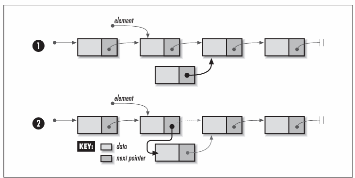
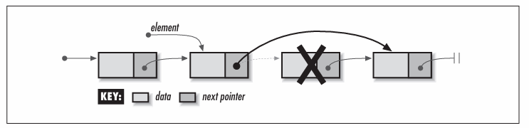

# Chapter 5 - Linked Lists
Linked lists are some of the most fundamental data structures Linked lists consist of a number of elements grouped, or *linked*, together in a specific order They are useful in maintaining collections of data, similar to the way that arrays are often used.

There are many different types of linked lists.
- Singly-linked lists
    - The simplest linked lists, in which elements are linked by a single pointer. This structure allows the list to be traversed from its first element to its last.

- Doubly-linked lists
    - Linked lists in which elements are linked by two pointers instead of one. This structure allows the list to be traversed both forward and backward.

- Circular lists
    - Linked lists in which the last element is linked to the first instead of being set to NULL. This structure allows the list to be traversed in a circular fashion.

Some applications of linked lists are:
- Mailing lists
- Scrolled lists
- Polynomials
- Memory management
- LISP
- Linked allocation of files
- Other data structures

## Description of Linked Lists
Singly-linked list, usually called linked lists, are composed of individual elements, each linked by a single pointer. Each element consists of two parts: a data member and a pointer, called the *next* pointer. Using this two-member structure, a linked list is formed by setting the *next* pointer of each element to point to the element that follows it. The next pointer of the last element is set to NULL, a covenient sentinel marking the end of the list. The element at the start of the list is its head; the element at the end of the list is its *tail*.

To access an elemment in a linked list, we start at the head of the list and use the *next* pointers of successive elements to move from element to element until the desired element is reached. With singly-linked lists, the list can be traversed in only one direction -- from head to tail -- because each element contains no link to its predecessor. Therefore, if we start at the head and move to some element, and then wish to access an element preceding it, we must start over at the head (although sometimes we can anticipate the need to know an element and save a pointer to it). Often this weakness is not a concern. When it is, we use a doubly-linked list, or circular list.

Conceptually, one thinks of a linked list as a series of continguous elements. However, because these elements are allocated dynamically (using *malloc* in C), it is important to remember that, in actuality, they are usually scattered about in memory. The pointers from element to eleent therefore are the only means by which we can ensure that all elements remain accessible. With this in mind, we will see later that special care is required when it comes to maintaining the links. If we mistakenly drop one link, it becomes impossible to access any of the elements from that point on in the list. Thus, the expression "You are only as strong as your weakest link" is particularly fitting for linked lists.


## Interface for Linked Lists

**list_init**
```c
void list_init(List *list, void (*destry)(void *data));
```
**Return Value:** None.

**Description:** Initialises the linked list specified by ```list```. This operation must be called for a linked list before the list can be used with any other operation. The ```destroy``` arguments provides a way to free dynamically allocated data when ```list_destroy``` is called. For example, if the list contains data dynamically allocated using ```malloc```, ```destroy``` should be set to free to free the data as the linked list is destroyed. For structured data containing several dynamically allocated members, ```destroy``` should be set to a user-defined function that calls free for each dynamically allocated member as well as for the structure itself. For a liniked list containing data that should not be freed, ```destroy``` should be set to NULL.

**Complexity:** O(1)

**list_destroy**
```c
void list_destroy(List *list);
```
**Return Value:** None.

**Description:** Destroys the linked list specified by ```list```. No other operations are permitted after calling ```list_destroy``` unless ```list_init``` is called again. The ```list_destroy``` operation removes all elements from a linked list and calls the function passed as ```destroy``` to ```list_init``` once for each element as it is removed, provided ```destroy``` was not set to NULL.

**Complexity:** O(n), where n is teh number of elements in the linked list.

**list_ins_next**
```c
int list_ins_next(List *list, ListElmt *element, const void *data);
```
**Return Value:** 0 if inserting the element is successful, or -1 otherwise.

**Description:** Inserts an element just after ```element``` in the linked list specified by ```list```. If ```element``` is NULL, the new element is inserted at the head of the list. The new element contains a pointer to ```data```, so the memoryreferenced by ```data``` should remain valid as long as the element remains in the list. It is the responsibility of teh caller to manage the storage associated with ```data```.

**Complexity:** O(1)

**list_rem_next**
```c
int list_rem_next(List *list, ListElmt *element, void **data);
```
**Return Value:** 0 if removing the elements is successful, or -1 otherwise.

**Description:** Removes the element just after ```element``` from the linked list specified by ```list```. If ```element``` is NULL, the element at the head of the list is removed. Upon return, ```data``` points to the data stored in the element that was removed It is the responsibility of the caller to manage the storage associated with the data.

**Complexity:** O(1)

**list_size**
```c
int list_size(const List *list);
```
**Return Value:** Number of elements in the list

**Description:** Macro that evaluates the number of elmenents in the linked list specified by ```list```.

**Complexity:** O(1)

**list_head**
```c
ListElmt *list_head(const List *list);
```
**Return Value:** Element at the head of the list.

**Description:** Macro that evaluates to the element at the head of the linked list specified by ```list```.

**Complexity:** O(1)

**list_tail**
```c
ListElmt *list_tail(const List *list);
```
**Return Value:** Element at the tail of the list.

**Description:** Macro that evaluates to the element at the tail of the linked list specified by ```list```.

**Complexity:** O(1)

**list_is_head**
```c
int list_is_head(const ListElmt *element);
```
**Return Value:** 1 if the element is at the head of the list, or 0 otherwise.

**Description:** Macro that determines whether the element specified as ```element``` is at the head of a linked list.

**Complexity:** O(1)

**list_is_tail**
```c
int list_is_tail(const ListElmt *element);
```
**Return Value:** 1 if the element is at the tail of the list, or 0 otherwise.

**Description:** Macro that determines whether the element specified as ```element``` is at the tail of a linked list.

**Complexity:** O(1)

**list_data**
```c
void *list_data(const ListElmt *element);
```
**Return Value:** Data stored in the element.

**Description:** Macro that evaluates to the data stored in the element of a linked list specified by ```element```.

**Complexity:** O(1)

**list_next**
```c
ListElmt *list_next(const ListElmt *element);
```
**Return Value:** Element following the specified element.

**Description:** Macro that evaluates to the element of a linked list following the element specified by ```element```.

**Complexity:** O(1)

## Implementation and Analysis of Linked Lists
Recall that each element of a linked list consists of two parts: a data member and a pointer to the next element in the list. The structure ```ListElmt``` represents an individual element of a linked list As you would expect, this structure has two members that correspond to those just mentioned. The structure ```List``` is the linked list data structure. This structure consists of five members: ```size``` is the number of elements in the list, ```match``` is a member not used by linked lists but by datatypes that will be derived later from linked lists, ```destroy``` is the encapsulated destroy function passed to ```list_init```, ```head``` is a pointer to the first of the linked element, and ```tail``` is a pointer to the tail element.

```c
#ifndef LIST_H
#define LIST_H

#include <stdlib.h>

typedef struct ListElmt_ {
    void *data;
    struct ListElmt_ *next;
} ListElmt;

typedef struct List_ {
    int size;
    int (*match)(const void *key1, const void *key2);
    void (*destroy)(void *data);

    ListElmt *head;
    ListElmt *tail;
} List;

void list_init(List *list, void (*destroy)(void *data));
void list_destroy(List *list);
int list_ins_next(List *list, ListElmt *element, const void *data);
int list_rem_next(List *list, ListElmt *element, void **data);

#define list_size(list) ((list)->size)
#define list_head(list) ((list)->head)
#define list_tail(list) ((list)->tail)
#define list_is_head(list, element) ((element) == (list)->head ? 1 : 0)
#define list_is_tail(element) ((element)->next == NULL ? 1 : 0)
#define list_data(element) ((element)->data)
#define list_next(element) ((element)->next)
#endif
```
#### list_init
The ```list_init``` operation initialises a linked list so that it can be used in other operations. Initialising a linked list is a simple operation in which the ```size``` member of the list is set to 0, the ```destroy``` member to ```destroy```, and the ```head``` and ```tail``` pointers to NULL.

The runtime complexity of ```list_init``` is O(1) because all of the steps in initialising a linked list run in a constant amount of time.

#### list_destroy
The ```list_destroy``` operation destroys a linked lists. Primarily this means removing all elements from the list. The function passed as ```destroy``` to ```list_init``` is called once for each element as it is removed, provided ```destroy``` was not set to NULL.

The runtime complexity of list_destroy is O(n), where n is teh number of element in the list This is because the O(1) operation ```list_rem_next``` must be called once for each element.

#### list_ins_next
The ```list_ins_next``` operation inserts an element into a linked lists just after a specified element. The call sets the new element to point to the data passed by the caller. The actual process of inserting the new element into the list is a simple one, but it does require some care. There are two cases to consider: insertion at the head of the list and insertion elsewhere.

Generally, to insert an element into a linked list, we set the ```next``` pointer of the new element to point to the element it is going to precede, and we set the ```next``` pointer of the element that will precede the new element to point to the new element. However, when inserting at the head of a list, there is no element that will precede the new element. Thus, in this case, we set the ```next``` pointer of the new element to the current head of the list, then reset the head of the list to point to the new element. Recall from the interface design in the previous section that passing NULL for ```element``` indicates that the new element should be inserted at the head. In addition to these tasks, whenever we insert an element at the tail of the list, we must update the ```tail``` member of the list data structure to point to the new tail. Last, we update the size of the list by incremmenting its ```size``` member.


The runtime complexity of ```list_ins_next``` is O(1) because all of the steps in inserting an element into a linked list run in a constant amount of time.

#### list_rem_next
The ```list_rem_next``` operation removes from a linked list the element just after a specified element. The reasons for removing the element just after, as opposed to the element itself is because, in the singly-linked list and circular list implementations, each element does not have a pointer to the one preceding it Therefore, we cannot set the preceding element's next pointer to the element after the one being removed An alternative approach to the one we selected would be to start at the head element and traverse the list, keeping track of each element preceding the next until the element to be removed is encountered. However, this solution is unattractive because the runtime complexity of removing an element from a singly-linked list or circular list degrades to O(n). Another approach would be to copy the data of the element following the specified element into the one specified and then remove the following element. However, this seemingly benign O(1) approach generates the dangerous side effect of rendering a pointer into the list invalid. This could be a surprise to a developer maintaining a pointer to the element after the one thought to be removed! The approach we selected, then, was to remove the element after the specified one The disadvantage of this approach is its inconsistency with the ```dlist_remove``` operation of the doubly-linked list implementation. However, this is addressed by the naming convention, using ```_rem_next``` as the suffix for removing an element after the one specified, and ```_remove``` to indicate that the specified element itself will be removed. In a doubly-linked list, recall that we can remove precisely the element specified because each element has a pointer to the one that precedes it.

As with inserting an element, this call requires consideration of two cases: removing an element from the head of the list and removing one elsewhere.

The actual process of removing the element from the list is a simple one, but it too requires some care. Generally, to remove an element from a linked list, we set the ```next``` pointer of the element preceding the one being removed to point to the element after the element being removed. However, when removing an element from the head of a list, there is no element that precedes the element being removed. Thus, in this case, we set the head of the list to point to the elmeent after the one being removed. As with insertion, NULL serves nicely as a sentinel passed in ```element``` to indicate that the element at the head of the list should be removed. In addition to these tasks, whenever we remove the element at the tail of the list, we must update the ```tail``` member of the list data structure to point to the new tail, or to NULL if removing the element has caused the list to become empty. Last, we update the size of the list by decreasing the ```size``` member by 1. Upon return, ```data``` points to the data from the element removed.


The runtime complexity of ```list_rem_next``` is O(1) because all of the steps in removing an element from a linked list run in a constant amount of time.

#### list_size, list_head, list_tail, list_is_tail, list_data, and list_next
These macros implement some of the simpler linked list operations. Generally, they provide an interface for accessing and testing members of the ```List``` and ```ListElmt``` structures.

The runtime complexity of these operations is O(1) because accessing and testing members of a structure are simple tasks that run in a constant amount of time.

```c
// Implementation of the Linked List Abstract Datatype
#include <stdlib.h>
#include <string.h>

#include "list.h"

void list_init(List *list, void (*destroy)(void *data)) {
    list->size = 0;
    list->destroy = destroy;
    list->head = NULL;
    list->tail = NULL;
    return;
}

// list_destroy
void list_destroy(List *list) {
    void *data;
    // Remove each element
    while (list_size(list) > 0) {
        if (list_rem_next(list, NULL, (void **)&data) == 0 && list->destroy != NULL) {
            list->destroy(data);
        }
    }
    memset(list, 0, sizeof(List));
    return;
}

// list_ins_next
int list_ins_next(List *list, ListElmt *element, const void *data) {
    ListElmt *new_element;
    // Allocate storage for the element.
    if ((new_element = (ListElmt *)malloc(sizeof(ListElmt))) == NULL) {
        return -1;
    }
    // Insert the element into the list.
    new_element->data = (void *)data;

    if (element == NULL) {
        // Handle insertion at the head of the list.
        if (list_size(list) == 0) {
            list->tail = new_element;
        }
        new_element-next = list->head;
        list->head = new_element;
    } else {
        // Handle insertion somewhere other than at the head.
        if (element->next == NULL) {
            list->tail = new_element;
        }
        new_element->next = element->next;
        element->next = new_element;
    }
    // Adjust the size of the list to account for the inserted element.
    list->size++;
    return 0;
}

// list_rem_next
int list_rem_next(List *list, ListElmt *element, void **data) {
    ListElmt *old_element;
    
    // Do not allow removal from an empty list!
    if (list_size(list) == 0) {
        return -1;
    }
    // Remove the element from the list.
    if (element == NULL) {
        // Handle removal from the head of the list.
        *data = list->head->data;
        old_element = list->head;
        list->head = list->head->next;

        if (list_size(list) == 1) {
            list->tail = NULL;
        }
    } else {
        // Handle removal from somewhere other than the head.
        if (element->next == NULL) {
            return -1;
        }
        *data = element->next->data;
        old_element = element->next;
        element->next = element->next->next;

        if (element->next == NULL) {
            list->tail = element;
        }
    }
    // Free the storage allocated by the abstract datatype.
    free(old_element);
    // Adjust the size of the list to account for the removed element.
    list->size--;
    return 0;
}
```
## Linked List Example: Frame Management
